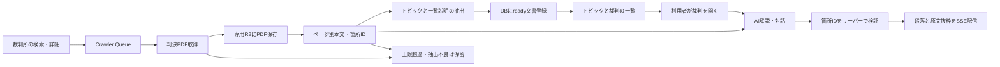

# トピックから判例を一緒に読む

既存のラベル型の複数選択と `/cases/$id` を、裁判所の原文とAI解説へ接続する。記事revisionの公開状態とは別に、文書の `ready` 状態で一覧への掲載を管理する。



## 保存と重複処理

- R2 `recourt-case-documents-v1` に `judgment/{PDFのSHA256}/v{処理版}/source.pdf`、`text.json`、`summary.json` を保存する。本文にはページごとの文字列と、最大1,200文字のページ内箇所ID `p{page}-{index}` を保持する。
- 処理版は `packages/types/src/reading/entry.ts` の `READING_VERSION`。抽出方式の変更時に更新する。既存文書を上書きせず、ブラウザ内の会話では開いた時の文書IDを固定する。
- `case_documents`、`reading_topics`、`case_document_topics` を追加する。同一事件・PDFハッシュ・処理版を一意とし、以前の文書版も参照できる。
- PDF全体の上限は25MiB、100ページ、抽出本文60,000文字。途中で切り捨てない。画像だけのPDF、文字を十分に抽出できないページ、破損ファイルは `held`。25MiB超や複数の全文PDFに分割された資料は `case_reading_holds` に取得元と理由を保存する。
- `unpdf` のサーバーレス版を利用する。日本語の文字マップと標準フォントには、同梱PDF.jsと同じ `pdfjs-dist@6.1.200` の固定URLを指定する。判決本文をこの配信先に送信しない。
- AIが抽出したラベルを別名辞書で揃え、括弧内の補足を除く。婚姻費用・離婚・同性婚などには親トピック「結婚」を対応付ける。件数は各事件の最新のready文書から集計する。
- 分類結果をR2へ保存し、DB登録を再試行してもAIを呼び直さない。同時取得は `case_classification_jobs` の期限付き所有権で排他する。`case_ai_gate` で新しい分類要求を15秒以上空ける。空き待ちはWorkflowの `step.sleep()` で行う。

## 初回と定期収集

CrawlerのService Binding、またはローカルポートで `POST /crawl/reading` を呼ぶ。合計の投入上限は50件。

| 検索        | 審級の検索区分               |      上限 |
| ----------- | ---------------------------- | --------: |
| 同性婚      | 統合検索（地裁・高裁を含む） |        17 |
| 殺人 + 量刑 | 最高裁 / 高裁 / 下級裁       | 5 / 5 / 7 |
| 婚姻        | 最高裁 / 高裁 / 下級裁       | 5 / 5 / 6 |

裁判所サイトは全文検索の件数が2,000件を超えると、裁判日の条件を適用する前に検索を拒否する。初回の殺人は量刑とのAND検索を使う。対象全件の網羅を意味しない。

毎日03:00 JSTのCronは同じ対象を再検索する。R2の `reading-search/{topic}/{category}.json` にページ番号とページ内の続き位置を記録して、次回は残りから巡回する。最終ページの後は先頭へ戻る。裁判日が直近7日以内という条件は使わない。公開された古い裁判も巡回時に拾うが、即日の検知は保証しない。

Queue v1は従来の記事生成Workflowへ、v2は判例読解用Workflowへ送る。旧メッセージの形式を維持する。読み込み済みのPDFも再取得してハッシュを照合し、同じ版のAI分類は再実行しない。

## 公開APIと読解

| API                                                | 用途                                           |
| -------------------------------------------------- | ---------------------------------------------- |
| `GET /api/topics`                                  | ready文書のトピックと事件数                    |
| `GET /api/cases?topics=...&offset=0`               | いずれかのトピックに一致する事件を20件ずつ取得 |
| `GET /api/cases/:caseId`                           | 事件と読解文書ID                               |
| `POST /api/cases/:caseId/explain`                  | `documentId`、`section`、`depth` を指定        |
| `POST /api/cases/:caseId/chat`                     | 上記と交互の `messages` を指定                 |
| `GET /api/cases/:caseId/documents/:documentId/pdf` | 保存済みPDF。単一Rangeに対応                   |

一覧は一致するトピック数、裁判日の降順、文書IDの順に並ぶ。検索条件はURLの `topics` に持たせ、一覧へ戻った時に復元する。初期表示は件数の多い16トピックと選択済みトピックで、「他のトピックも見る」からすべてを選べる。

モデルは利用者指定の `openai/gpt-5.2`。Vercel AI Gatewayを利用する。項目は全体像・背景・争点・判断理由、詳しさは短く・標準・詳しく。初回は全体像・標準。生成済みの項目は画面内で再利用する。項目や詳しさの変更、離脱、中止操作は進行中の生成を止める。

分類・解説とも構造化出力の箇所IDを保存本文のIDの列挙型に制限する。`Output.array()` の `elementStream` から段落を受け取り、実在する箇所IDを再検証した後で `paragraph` SSEイベントを送る。抜粋とページ番号は保存本文から取得する。終了は `done`、失敗は `error`。根拠のない判断段落は配信しない。IDの存在確認は説明内容の正しさを自動的に保証するものではないため、実データ検証で主張・認定・判断との対応も確認する。

会話はタブ内の `sessionStorage` に文書ID単位で保持し、直近の完了した9往復を次の質問に渡す。生成に失敗した途中の返答は会話履歴へ追加しない。一般的な用語説明と本文で確認できない事項は表示上も区別する。

## ローカル開発

Internalの `.dev.vars` にローカルDBの `DB_URL`、APIの `.dev.vars` に `DB_URL` と `VERCEL_AI_GATEWAY_API_KEY`、Extractの `.dev.vars` に `VERCEL_AI_GATEWAY_API_KEY` を設定し、DBへマイグレーションを適用する。リポジトリのルートで `pnpm dev` を実行する。

Crawler・External・Extract・Internalは1つのWranglerで起動し、ルートの `.wrangler/state` に保存する。Extractが書いたPDF・本文をInternalが同じR2から読めるようにし、Queueの送受信も同じ実行環境でつなぐ。APIは8787、Crawlerは8788、Webは5137で起動する。補助Workerの個別ポートは使用しない（[Cloudflareの複数Worker開発](https://developers.cloudflare.com/workers/local-development/multi-workers/)）。各Workerの `dev` を同時に個別起動しない。

```sh
# 初回収集。AI分類の利用量が発生する
curl -X POST http://localhost:8788/crawl/reading
```

DBとR2は組で保持する。DBだけを復元すると本文・PDFを取得できないため、同じ保存先を戻すか、初回収集を再実行する。現在の実データ検証用プレビューの起動構成は [検証記録](case-reading-validation.md#検証環境) に記載する。

## 導入

1. CockroachDBへ `packages/database/migrations` の追加マイグレーションを順番に適用する。既存DBで初期マイグレーションが適用済みなら、再適用しない。
2. Terraformの `recourt_case_documents` を適用してR2を作成する。Crawler・Extract・Internalで同じバケットを共有する。
3. 既存のCrawler/Extract Queue、DLQ、Workflowを作成する。Extractには新しい `PREPARE_CASE_READING` Workflowを追加する。
4. Internalの `DB_URL`、APIとExtractの `VERCEL_AI_GATEWAY_API_KEY` を設定する。APIのDB設定は従来のURL読解機能でも使う。API→Internal、Extract→Internal/External、Crawler→ExternalのService Bindingを確認する。
5. `WEB_ORIGIN` をWebの実際のオリジンに設定する。標準のWeb API接続先は開発時 `http://localhost:8787`、公開時 `https://api.recourt-v1.tuki.dev`。検証時は `VITE_CASE_API_URL` で変更できる。
6. Internal・External・Extract・Crawler・API・Webを導入し、初回収集を開始する。主要トピックの表示、詳しさの変更、対話、原文抜粋、保存PDFの該当ページまで確認する。

Workersを外部公開しないInternal/Crawler/ExtractはService Binding経由で操作する。AI Gatewayのモデル利用権と要求上限も確認する。無料枠の要求上限では、初回収集の分類に待ち時間が生じる。

## 検証とログ

`pnpm --filter @recourt/api test`、`@recourt/internal`、`@recourt/crawler`、`@recourt/extract`、`web` の各テストと型チェックを実行する。本文のページ境界、画像・破損・上限超過、箇所ID拒否、ピン留めした文書、SSEの完了確認、中断、通信失敗からの再試行を対象とする。

分類と解説は、所要時間・SDKのトークン使用量・成功/失敗イベントをJSONで記録する。利用者の中止は `case_reading_cancelled` として失敗と分ける。APIにはクライアント切断を検知する `enable_request_signal` 互換性フラグを設定する（[Cloudflareの説明](https://developers.cloudflare.com/changelog/post/2025-05-22-handle-request-cancellation/)）。取得・抽出・保存の失敗はWorkflow状態、Queue/DLQ、保留理由で確認する。本文・会話・APIキーはログに出力しない。Cloudflare Observabilityを有効にし、成功イベントと失敗イベントの件数から失敗率を集計する。

OCR、長大な判決の検索、複数判例の比較、裁判官の傾向評価は次段階とする。
