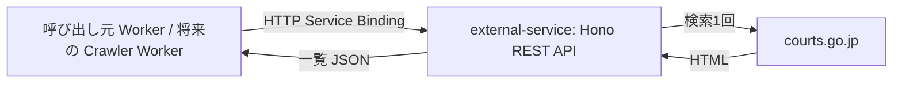

# 裁判例検索の調査と external-service API

調査日: 2026-09-16。対象は裁判所の[裁判例検索](https://www.courts.go.jp/hanrei/search1/index.html)の7画面。各画面のフォームと検索操作を確認した結果を、`app/external-service` への実装に向けて整理する。裁判所側の画面やパラメータは変更され得るため、以下は取得時点の仕様として扱う。

## 共通の検索動作

- 絞り込みを選んだ時点ではURLは変わらない。「検索」で各 `/hanrei/searchN/index.html` へ `GET` し、条件はquery string、結果位置は `#searched` になる。フラグメントはサーバーへ送信されない。
- 主なキーは `query1`（全文検索）、`query2`（さらに含める語）、`filter[...]`。空のフォーム項目も多くが `key=` として送られる。`URLSearchParams` でキーを組み立て、検索画面ごとの実測URLを回帰確認に使う。
- `filter[judgeDateMode]` は `1=期日指定`、`2=期間指定`。日付は元号・年・月・日を別々に送る。FROM/TOのキーはそれぞれ `filter[judgeGengoFrom]`、`filter[judgeYearFrom]`、`filter[judgeMonthFrom]`、`filter[judgeDayFrom]` と `...To`。元号の値は「令和」「平成」「昭和」の文字列。
- 事件番号は `filter[jikenGengo]`、`filter[jikenYear]`、`filter[jikenCode]`、`filter[jikenNumber]`。符号は表示文字列ではなく選択肢の内部数値を送る。統合検索で `(あ)=1`、高裁・下級裁検索で `(う)=2` を確認した。
- 結果を表示できた専門検索（search2〜7）は30件ずつ。画面の「次へ」は `javascript:change_offset(30)` だが、遷移後の実URLには `offset=30` が付く。さらに30件ごとに増える。search1では検索結果とページ送りを実測できていない。並び替えを確認したsearch3では `sort` もqueryに入る。
- 公式の使い方は、同一判決が複数カテゴリーに属する場合があると明記している。検索経路ごとにレコードを作らず、詳細URLの数値IDをまず同一性のキーとする。ただし詳細の種別やPDFリンクは実ページから抽出し、IDからURLを推測生成しない。
- 広い検索では「検索結果が2000件を超えました」となり一覧を取得できない場合がある。バックフィルは裁判年月日を狭い期間に分割し、上限超過ならさらに分割する。

共通の日付・事件番号キーは以下の通り。

| 項目 | queryキーと値 |
|---|---|
| 全文検索 | `query1=語`、`query2=追加語` |
| 裁判年月日の指定方式 | `filter[judgeDateMode]=1` または `2` |
| 裁判年月日の開始 | `filter[judgeGengoFrom]`、`filter[judgeYearFrom]`、`filter[judgeMonthFrom]`、`filter[judgeDayFrom]` |
| 裁判年月日の終了 | `filter[judgeGengoTo]`、`filter[judgeYearTo]`、`filter[judgeMonthTo]`、`filter[judgeDayTo]` |
| 事件番号 | `filter[jikenGengo]`、`filter[jikenYear]`、`filter[jikenCode]`、`filter[jikenNumber]` |
| ページ送り | `offset=0,30,60,...` |

### 各画面の絞り込み

| 画面 | 固定の区分 | 共通項目以外の絞り込み |
|---|---|---|
| [統合検索](https://www.courts.go.jp/hanrei/search1/index.html) | `courtCaseType`なし | 裁判所名: 審級・管轄・裁判所・支部 |
| [最高裁判所](https://www.courts.go.jp/hanrei/search2/index.html) | `courtCaseType=1` | 判例集/裁判集、民刑区分、法廷名、裁判種別、事件名、結果、原審裁判所名・裁判年月日、参照法条、判示事項、裁判要旨 |
| [高等裁判所](https://www.courts.go.jp/hanrei/search3/index.html) | `courtCaseType=2` | 裁判所名・支部、高裁判例集の巻号頁、事件名 |
| [下級裁判所（速報）](https://www.courts.go.jp/hanrei/search4/index.html) | `courtCaseType=3` | 裁判所名: 審級・管轄・裁判所・支部 |
| [行政事件](https://www.courts.go.jp/hanrei/search5/index.html) | `courtCaseType=4` | 裁判所名、事件名、事件種別 |
| [労働事件](https://www.courts.go.jp/hanrei/search6/index.html) | `courtCaseType=5` | 裁判所名、事件名 |
| [知的財産事件](https://www.courts.go.jp/hanrei/search7/index.html) | `view=main` は `courtCaseType=6 7`、`view=chizai` は `courtCaseType=7` | 表示モードごとに事件番号・裁判所、権利種別、訴訟類型、知財高裁固有条件など |

### 統合検索（search1）

裁判所名は `filter[courtType]`（最高=1、高等=2、地方=3、家庭=4、簡易=5）、`filter[courtSection]`（最高裁判所=1、知財高裁=2、各高裁管内=3〜10）、`filter[courtName]`、`filter[branchName]`。審級と管轄を選ぶと裁判所候補が絞られる。支部候補は確認範囲では変わらなかった。事件番号符号は約118の候補を持つ。

実測例: `query1=憲法` は `https://www.courts.go.jp/hanrei/search1/index.html?query1=%E6%86%B2%E6%B3%95&query2=&...#searched`。日付欄を埋めても `judgeDateMode` を選ばない場合は入力エラーになる。広いキーワード検索は2000件上限で一覧が表示されない。

search1固有の結果一覧、詳細URL、ページ送りは今回実測できなかった。クローラーでsearch1を使う前に、件数の少ない条件で結果パーサーを別途確認する。

### 最高裁判所（search2）

| 絞り込み | queryキーと実測・フォーム上の値 |
|---|---|
| 判例集の巻・号・頁 | `filter[reportV1]`、`filter[reportI1]`、`filter[reportP1]` |
| 裁判集の号・頁 | `filter[reportI2]`、`filter[reportP2]` |
| 判例集/裁判集の切替 | `filter[precedentMode]=1` 判例集、`=2` 裁判集 |
| 民刑区分 | `filter[division][]=1` 民事、`[]=2` 刑事 |
| 法廷名 | `filter[houtei][]=1` 大法廷、`2` 第一、`3` 第二、`4` 第三小法廷 |
| 裁判種別 | `filter[judgeType][]=1` 判決、`2` 決定 |
| 事件名 | `filter[jikenName]`、`filter[jikenNameMode]=2` OR / `1` AND |
| 結果 | `filter[judgeResult][]=1` 棄却、`2` 破棄自判、`3` 破棄差戻、`4` 却下、`5` その他 |
| 原審裁判所 | `filter[genshinCourtType]`、`filter[genshinCourtSection]`、`filter[genshinCourtName]`、`filter[genshinBranchName]` |
| 原審裁判年月日 | `filter[genshinJudgeDateMode]=1` 期日、`=2` 期間、`filter[genshinJudgeGengoFrom]`～`filter[genshinJudgeDayTo]` |
| 参照法条 | `filter[reference]`、`filter[referenceMode]=2` OR / `1` AND |
| 判示事項 | `filter[note_1_1]`、`filter[note_1_2]` |
| 裁判要旨 | `filter[point1]`、`filter[point2]` |

チェックボックスのキー・値および裁判集側のキーは公式フォームの `name`/`value` で確認した。最近の一覧へのリンクは `?courtCaseType=1&filter%5Brecent%5D=1`。民事条件で1ページ30件、次ページは `offset=30` を確認。詳細例は [`/hanrei/97044/detail2/index.html`](https://www.courts.go.jp/hanrei/97044/detail2/index.html)。

### 高等裁判所（search3）

裁判所名は `filter[courtName]`（知財高裁、各高裁の文字列）と `filter[branchName]`。高裁判例集は `filter[reportV1]`、`filter[reportI1]`、`filter[reportP1]`。事件名は `filter[jikenName]` と `filter[jikenNameMode]`（OR=2、AND=1）。裁判年月日と事件番号は共通項目。事件番号符号は約52種類で、例として `(う)=2`、`(控訴)=74`。

`query1=裁判` は2000件超過。裁判所を東京高裁にすると `filter[courtName]=東京高等裁判所` がURLエンコードされる。`sort` で裁判年月日降順・昇順・裁判所建制順を選択でき、並び替え時は `offset=0` に戻る。詳細例は [`/hanrei/20249/detail3/index.html`](https://www.courts.go.jp/hanrei/20249/detail3/index.html)。

### 下級裁判所（search4）

裁判所名は `filter[courtType]`（高等・地方・家庭・簡易）、`filter[courtSection]`、`filter[courtName]`、`filter[branchName]`。事件番号符号は約85種類で、表示 `(ね)` の送信値は `15`。裁判所「東京地方裁判所」・支部「立川」の選択では、`filter[courtType]=3`、`filter[courtName]=東京地方裁判所`、`filter[branchName]=立川支部` になる。

最近の一覧リンクは `?courtCaseType=3&filter%5Brecent%5D=1#searched`。2026-09-16時点で56件、2ページ目は同じ条件に `offset=30`。詳細例は [`/hanrei/96922/detail4/index.html`](https://www.courts.go.jp/hanrei/96922/detail4/index.html)。

### 行政事件（search5）

裁判所名は `filter[courtType]`（高等=2、地方=3）、`filter[courtSection]`、`filter[courtName]`、`filter[branchName]`。事件名は `filter[jikenName]` と `filter[jikenNameMode]`（OR=2、AND=1）。裁判年月日と事件番号は共通項目。

事件種別は複数選択の `filter[caseType][]`。公式フォームの `name` と `value` を確認した対応は次の通り。

| 値 | 表示名 |
|---|---|
| 1 | 選挙 |
| 2 | 住民訴訟 |
| 3 | 情報公開 |
| 4 | 地方自治（住民訴訟、情報公開を除く） |
| 5 | 租税 |
| 6 | 公用負担・公用収用など |
| 7 | 警察（建築、営業認可、公衆衛生、外事など）関係 |
| 8 | 公物・公企業など |
| 9 | その他 |

フォームは `/hanrei/search5/index.html#searched` にGETで送信する。事件種別「選挙」を選んで検索した実URLは `?courtCaseType=4&query1=&query2=&...&filter%5BcaseType%5D%5B%5D=1#searched`。チェックボックスを選んだ時点ではURLは変わらず、検索押下で `courtCaseType=4` と事件種別の配列キーが付いた。選挙だけの条件では136件で、2ページ目は `?courtCaseType=4&filter%5BcaseType%5D%5B%5D=1&offset=30#searched`。詳細例は [`/hanrei/88290/detail5/index.html`](https://www.courts.go.jp/hanrei/88290/detail5/index.html)で、ページ上の全文PDFリンクは `/assets/hanrei/hanrei-pdf-88290.pdf`。

### 労働事件（search6）

裁判所名は `filter[courtType]`（最高=1、高等=2、地方=3、簡易=5）、`filter[courtSection]`、`filter[courtName]`、`filter[branchName]`。事件名は `filter[jikenName]` と `filter[jikenNameMode]`（OR=2、AND=1）。裁判年月日と事件番号は共通項目。事件番号符号は32種類で、例として `(ネ)=46`、`(行ウ)=76`、`(受)=94`。

実測例: `query1=賃金` は `?courtCaseType=5&query1=%E8%B3%83%E9%87%91&query2=&...#searched`。`query1=東芝`、`query2=解雇`、事件名条件ANDを選んだ場合は `filter[jikenNameMode]=1` が追加される。`query1=解雇` の検索では30件表示の2ページ目があり、次ページは `offset=30`。詳細例は [`/hanrei/82398/detail6/index.html`](https://www.courts.go.jp/hanrei/82398/detail6/index.html)。

### 知的財産事件（search7）

この画面は2つの表示モードがある。`view=main` は「知財高裁の裁判例以外も含む」で `courtCaseType=6 7`（URL上は `6+7` または `%20`）。`view=chizai` は「知財高裁の裁判例のみ」で `courtCaseType=7`。DOMには両モードのフォーム項目が存在するが、検索時に選択したモードの項目だけが送信される。共通の全文検索・裁判年月日は両方で使う。

| 表示モード | 固有の絞り込みとqueryキー |
|---|---|
| `main` | 事件番号 `filter[jikenGengo]`～`filter[jikenNumber]`、裁判所 `filter[courtType]`～`filter[branchName]`、権利種別 `filter[rightType][]`、訴訟類型 `filter[suitType][]` |
| `chizai` | 事件番号、原審裁判所 `filter[genshinCourtType]`～`filter[genshinBranchName]`、原審事件番号 `filter[genshinJikenGengo]`～`filter[genshinJikenNumber]`、判決結果 `filter[chizaiJudgeResult]`、事件種類 `filter[chizaiCaseType][]`、審決種別 `filter[shinketsu]`、権利種別 `filter[chizaiRightType][]`、上告審 `filter[appeal][]`、上告審結果 `filter[appealResult]` |

`main` の権利種別は特許=1、実用新案=2、意匠=3、商標=4、著作権=5、不正競争=6、その他=7。訴訟類型は行政=1、民事=2、民事仮処分=3。`chizai` の事件種類は審決取消訴訟=1、侵害訴訟等控訴事件=2、決定・その他=3。`chizai` の権利種別は同じ1〜7で別キー。上告審は上告提起=1、上告受理申立て=2、両方=3。

`chizai` 固有の単一選択の値は次の通り。これらは公式フォームのoption値であり、ラベルから文字列を作って送らない。

| queryキー | 値と表示名 |
|---|---|
| `filter[chizaiJudgeResult]` | 1 控訴棄却、2 原判決取消、3 原判決変更、4 原判決一部取消、5 原判決一部変更、6 審決取消、7 決定取消、8 審決一部取消、9 決定一部取消、10 請求棄却、11 訴却下、12 その他、13 抗告棄却、14 抗告却下、15 原決定取消、16 原決定変更、17 移送決定、18 移送却下決定、19 審決取消（特許法181条2項による決定）、20 控訴却下決定 |
| `filter[shinketsu]` | 1 審決（拒絶）取消、2 審決（無効・成立）取消、3 審決（無効・不成立）取消、4 審決（訂正不成立）取消、5 審決（却下）取消、6 特許取消決定取消、7 商標取消決定取消、8 審決（取消・成立）取消、9 審決（取消・不成立）取消、10 却下決定取消、11 その他 |
| `filter[appealResult]` | 1 不受理、2 棄却（決定）、3 棄却（判決）、4 破棄差戻、5 破棄自判、6 却下、7 その他 |

実測URL: 最近の一覧は `?courtCaseType=6%207&filter%5Brecent%5D=1&view=main#searched` で61件、2ページ目は `offset=30`。知財高裁限定の審決取消訴訟・特許権・審決取消は `?view=chizai&courtCaseType=7&filter%5BchizaiCaseType%5D%5B%5D=1&filter%5BchizaiRightType%5D%5B%5D=1&filter%5BchizaiJudgeResult%5D=6` で739件。詳細例は [`/hanrei/96963/detail8/index.html`](https://www.courts.go.jp/hanrei/96963/detail8/index.html)で、全文PDFに加え要旨PDFがある。

## `external-service` の実装範囲

[`app/external-service/src/main.ts`](../app/external-service/src/main.ts) は、裁判所の検索画面に1回問い合わせて結果を返す Hono の REST API を提供する。画面ごとのqueryスキーマは[`search-query.ts`](../app/external-service/src/courts/search-query.ts)で Zod により定義し、各ルートの `sValidator` で検証する。固定の裁判所URLとqueryの組み立ては[`search-url.ts`](../app/external-service/src/courts/search-url.ts)、一覧HTMLの抽出は[`search-results.ts`](../app/external-service/src/courts/search-results.ts)でWorkersの[`HTMLRewriter`](https://developers.cloudflare.com/workers/runtime-apis/html-rewriter/)を使う。



`external-service` は検索1回分のURL構築、入力検証、HTTP取得、結果一覧の抽出だけを行う。Cron、Queue、ページの反復、再試行、重複排除、保存、記事生成はここでは行わない。将来の Crawler Worker が必要に応じてこれらを担当する。

### API

各検索画面に固定の GET エンドポイントを設ける。裁判所サイトの `search1`〜`search7` という番号は接続先URLを選ぶためだけに使い、APIパスには出さない。

| エンドポイント | 検索画面 |
|---|---|
| `GET /courts/hanrei/search/general` | 統合検索（search1） |
| `GET /courts/hanrei/search/saikosai` | 最高裁判所（search2） |
| `GET /courts/hanrei/search/kosai` | 高等裁判所（search3） |
| `GET /courts/hanrei/search/kakyusai` | 下級裁判所（search4） |
| `GET /courts/hanrei/search/gyosei` | 行政事件（search5） |
| `GET /courts/hanrei/search/rodo` | 労働事件（search6） |
| `GET /courts/hanrei/search/chizai` | 知的財産事件（search7） |

query string には裁判所サイトと同じ `query1`、`query2`、各ルートのスキーマに定義した `filter[...]`、`offset`、`sort` を指定する。`chizai` では `view=main`（既定）または `view=chizai` を指定する。`courtCaseType` は検索画面と `view` からサーバー側で固定し、呼び出し元からは受け付けない。配列の絞り込みは同名キーを繰り返す。未定義の条件、複数回指定された単一値、条件のない検索は `400` を返す。

例:

```text
GET /courts/hanrei/search/gyosei?filter%5BcaseType%5D%5B%5D=1&offset=30
GET /courts/hanrei/search/chizai?view=chizai&filter%5BchizaiCaseType%5D%5B%5D=1
```

成功時は `source`、`category`、`upstreamUrl`、`total`、`offset`、`nextOffset`、`results` を返す。各 `results` には裁判例 `id`、一覧の `label`、実ページで確認した `detailUrl`、一覧の表示テキスト `lines`、一覧にある `pdfs` を含む。PDFのない行は空配列になる。`nextOffset` は次のページがある場合のみ数値となる。

入力不正は `400 VALIDATION_ERROR`、2000件上限は `422 UPSTREAM_RESULT_LIMIT`、裁判所サイトへの通信失敗や想定外のHTMLは `502`、上流の `429` は `503` を返す。応答は `{ "error": { "code": "...", "message": "..." } }` 形式。

呼び出し元 Worker の `wrangler.jsonc` に次の Service Binding を宣言する。接続先の `external-service` 自身は `workers_dev: false` とし、公開URLを持たせない。

```jsonc
"services": [
  { "binding": "EXTERNAL_SERVICE", "service": "recourt-external-service" }
]
```

```ts
const response = await env.EXTERNAL_SERVICE.fetch(
  new Request("https://external-service.internal/courts/hanrei/search/kakyusai?filter%5Brecent%5D=1"),
);
```

Service Binding の `fetch` は有効な完全URLを要求するが、ホスト名は接続先Workerのルーティングには使われない。設定は[CloudflareのHTTP Service Binding仕様](https://developers.cloudflare.com/workers/runtime-apis/bindings/service-bindings/http/)に従う。

### 確認事項

- search4の実HTML由来の一覧行、0件、2000件超過の形をローカル workerd で検証した。7画面すべての実HTMLに対する本番Workersからの取得は未確認である。
- `search1` の結果一覧は調査時に実測できなかった。結果構造が異なる場合は `502 UPSTREAM_FORMAT_ERROR` になるため、運用前に少数件検索で確認する。
- 裁判所側のフォームやHTMLは変更され得る。クローラー運用前に各画面で検索・ページ送りを確認し、入力条件とパーサーを更新する。

## 参照

- [裁判所: 判例検索システムの使い方](https://www.courts.go.jp/hanrei/search1/index.html)
- [Cloudflare Workers HTMLRewriter](https://developers.cloudflare.com/workers/runtime-apis/html-rewriter/)
- [Cloudflare Workersの制限](https://developers.cloudflare.com/workers/platform/limits/)
- [Cloudflare HTTP Service Bindings](https://developers.cloudflare.com/workers/runtime-apis/bindings/service-bindings/http/)
