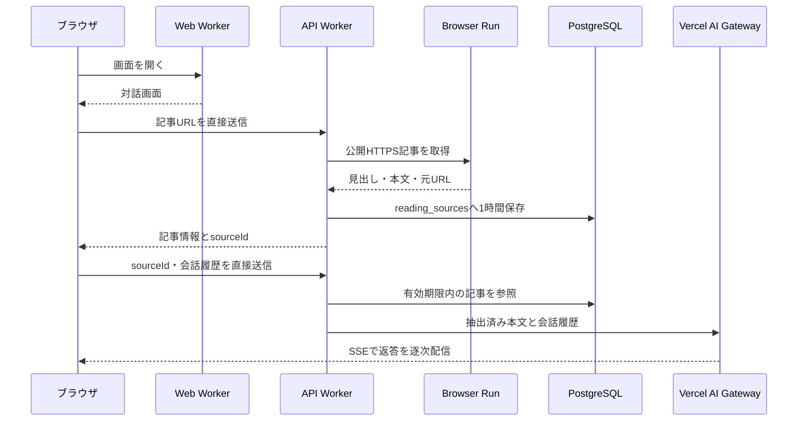

# 記事から始める対話

公開記事のURLを取り込み、記事本文を資料にしてAIと対話する試作機能。判決本文は取得せず、画面とAIの返答で未確認と明示する。会話履歴はブラウザのメモリにのみ保持し、再読み込みすると消える。



## 公開前の設定

1. 既存のPostgreSQLに [`0001_lumpy_madripoor.sql`](../packages/database/migrations/0001_lumpy_madripoor.sql) を適用する。既存DBにまだ初期スキーマがない環境では、先に `0000_court_case_natural_key.sql` を適用する。DBの状態を確認し、既に存在するテーブルを再作成しない。
2. `recourt-api` Workerに `DB_URL` と `VERCEL_AI_GATEWAY_API_KEY` をシークレットとして設定する。ローカル開発では `app/api/.dev.vars` または環境変数を使う。
3. API WorkerのCustom Domain `api.recourt-v1.tuki.dev` を先に公開し、`https://recourt-v1.tuki.dev` からのCORSプリフライトを確認してからWeb Workerをデプロイする。Web WorkerはAPIリクエストを中継しない。API Workerの `workers.dev` 公開URLは無効のままにする。

ローカルでは `pnpm dev` でAPI（`localhost:8787`）とWeb（`localhost:5137`）を起動する。APIの `WEB_ORIGIN` は開発用コマンドで `http://localhost:5137` に切り替わる。ブラウザからの取込・削除・チャットはHono RPCでAPIへ直接送られる。

データベースの変更後は次の方法で動作を確認できる。

```sh
pnpm --filter @recourt/api test
pnpm --filter @recourt/api typecheck
pnpm --filter web test
pnpm --filter web typecheck
pnpm --filter web build
```

## 制限と削除

- 取得先は公開HTTPS URLに限定し、DNS、Browser Run Guardrails、ページ内リクエストの三段階でホストを制限する。許可するリダイレクトは同じホストと、公開DNSで確認できる `www` 付き・なしの対だけ。
- 本文は最大2万字。取得が成功した記事だけ `reading_sources` に保存し、1時間後は参照を拒否する。毎時のCron Triggerが期限切れ行を削除する。利用者が会話を終了したときも該当行を削除する。
- 1会話は最大20メッセージ。取込は送信元IPごとに毎分3回、会話APIは送信元IPごとに毎分20回。リクエスト本文は100 KiB、各会話メッセージは最大4,000字（画面の入力欄は2,000字）。
- 記事本文や会話内容はAPIログに記録しない。AIへ記事URLを開くツールは渡さない。CAPTCHAや有料記事の制限を回避する処理はない。
